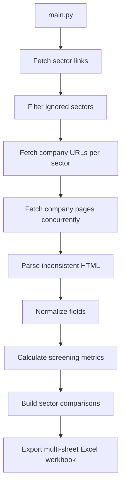

# DSE Company Data Scraper

> Public architecture preview of a production-minded async data pipeline for collecting, normalizing, analyzing, and exporting Dhaka Stock Exchange company fundamentals.

**Repository status:** public preview only. This repository intentionally shows the architecture, module boundaries, data flow, output structure, and capabilities of the project without publishing the production scraper implementation. The runnable source remains private to protect the work from unauthorized copying, republishing, and result exploitation.

[](https://www.python.org/)
[](#public-preview-boundary)
[](#excel-output-preview)
[](#license-and-usage)

## Why This Project Exists

The Dhaka Stock Exchange website exposes valuable company data, but the pages are not shaped like a clean API. Tables are nested, labels vary, values can move between sections, and missing fields are common.

The private implementation turns that messy public HTML into a structured Excel dataset for screening, research, and decision support. This public repository previews how the system is organized and what it can produce without exposing the extraction rules, parser selectors, scoring logic, or workbook-generation internals.


## Public Preview Boundary

Included:

- Architecture and data-flow documentation
- Public interface skeletons for the main pipeline modules
- Workbook sheet and column previews
- Review guidance for portfolio, hiring, and client evaluation
- Security, license, and IP-protection notes
- Execution-flow diagram

Not included:

- Production scraping logic
- Live HTML selectors and parser rules
- Website-specific fallback handling
- Workbook scoring and formatting implementation
- Generated Excel files, logs, or market-analysis outputs
- Operational dependency pins for the private runtime

Running `python main.py` will intentionally exit with a preview-only message.

## Highlights

| Area                  | Private implementation capability                                                           |
| --------------------- | ------------------------------------------------------------------------------------------- |
| Async pipeline        | `asyncio` orchestration with bounded sector and company concurrency                         |
| Adaptive throttling   | Dynamic pacing and concurrency reduction after failures                                     |
| Retry strategy        | Request retries with jitter for transient failures                                          |
| Sector discovery      | Discovers tradable DSE sector links and skips non-equity-like groups                        |
| Company discovery     | Collects company detail URLs per sector                                                     |
| Robust parsing        | Combines table extraction, DOM traversal, regex, and fallback logic                         |
| Normalization         | Converts inconsistent raw strings into clean numeric and text fields                        |
| Financial coverage    | Market data, capital structure, debt, EPS, P/E, audited metrics, dividends, ownership       |
| Analysis-ready export | Multi-sheet Excel workbook with raw data, processed analysis, sector summary, and watchlist |
| Data quality          | Flags missing fields, outliers, and unreliable metrics before comparison                    |
| Automation            | Private scheduled/manual workflow for market-day runs                                       |

## Architecture



Module boundary preview:

```text
main.py
  -> pipelines/sectors.py
  -> pipelines/companies.py
  -> pipelines/company_info.py
  -> core/client.py
  -> core/parser.py
  -> export/excel.py
```

## Data Collected Preview

The private workbook is designed around practical equity-research workflows.

| Group                      | Example fields                                                                                   |
| -------------------------- | ------------------------------------------------------------------------------------------------ |
| Identity                   | Company name, trading code, scrip code, sector, instrument type                                  |
| Listing metadata           | Listing year, market category, electronic share, debut trading date                              |
| Market price               | LTP, YCP, open, adjusted open, close, day range, 52-week range                                   |
| Movement                   | Change value and change percentage                                                               |
| Liquidity                  | Trade count, volume, traded value                                                                |
| Capital structure          | Market cap, free float cap, authorized capital, paid-up capital, securities, face value          |
| Debt and status            | Operational status, loan-status date, short-term loan, long-term loan, total loan                |
| EPS                        | Quarterly, half-yearly, nine-month, annual, continuing operations, diluted continuing operations |
| Annual audited performance | EPS, diluted EPS, NAVPS, operating cash flow, profit, total comprehensive income                 |
| Valuation                  | Basic EPS P/E, diluted EPS P/E, trailing P/E, audited basic EPS P/E                              |
| Corporate actions          | AGM, year ended, dividend year, dividend yield, cash dividend, bonus issue, right issue          |
| Ownership                  | Flattened shareholding percentage rows                                                           |

## Data Quality Strategy

The private parser is designed for inconsistent pages and missing fields. The public skeleton shows the boundaries, while the detailed implementation remains private.

The strategy includes:

- Layered extraction instead of one brittle selector
- Defensive null handling for missing or shifted fields
- Duplicate prevention when a field is already normalized under a clearer name
- Stable output ordering so workbooks can be compared over time
- Removal and audit of fully empty raw columns
- Sector medians and trimmed averages to reduce outlier distortion
- Outlier flags separating unreliable metrics from usable valuation comparisons

## Excel Output Preview

Generated files in the private runtime follow this pattern:

```bash
Export_Data/DSE_Data_{Market_Date}.xlsx
```

The workbook contains:

| Worksheet               | Purpose                                                                 |
| ----------------------- | ----------------------------------------------------------------------- |
| `Workbook_Guide`        | Plain-language guide explaining sheets, labels, metrics, and usage      |
| `Raw_Scraped_Data`      | Cleaned raw scrape output with fully empty columns removed              |
| `Processed_Analysis`    | Derived ratios, sector comparisons, scores, valuation signal, and notes |
| `Sector_Summary`        | Sector-level averages, medians, trimmed averages, and decision counts   |
| `Watchlist`             | Focused list of companies that deserve follow-up review                 |
| `Data_Quality_Issues`   | Companies with weak reliability, missing fields, or outlier concerns    |
| `Dropped_Empty_Columns` | Audit list of raw columns removed because every company was blank       |

Final screening labels include:

- Potentially Undervalued
- Fairly Valued / Worth Watching
- Fairly Valued
- Potentially Overvalued
- Value Trap Risk
- Speculative / Risky
- Insufficient Data

The processed analysis layer is intended for primary screening only. It helps identify companies worth deeper research, but it is not an automatic buy/sell recommendation system.

## Automation Preview

The private repository supports scheduled and manual runs. The production schedule runs Sunday through Thursday after the Bangladesh market close.

```yaml
cron: "20 14 * * 0-4"
```

This public repository does not run the scraper or publish generated workbooks. Its GitHub workflow only validates that the preview skeleton remains syntactically healthy.

## How To Review This Repo

For portfolio, hiring, or client review:

- Read this README for project scope, architecture, and engineering decisions
- Read [PORTFOLIO_REVIEW.md](PORTFOLIO_REVIEW.md) for a concise reviewer brief
- Review `Execution Flow.jpg` for the end-to-end flow
- Inspect `main.py` and module skeletons for the system shape
- Ask for a live walkthrough, redacted workbook screenshots, or selected sanitized excerpts if deeper evaluation is needed

## Project Structure

```text
DSE_COMPANY_SCRAPER_Python/
|
├── .github/workflows/
│   └── preview-validation.yml
|
├── core/
│   ├── client.py            # Async HTTP client/throttle interface preview
│   ├── holidays.py          # Market-calendar interface preview
│   ├── logger.py            # Shared logger boundary
│   └── parser.py            # Parser and normalized schema preview
|
├── export/
│   └── excel.py             # Workbook sheet and analysis schema preview
|
├── pipelines/
│   ├── sectors.py           # Sector discovery stage boundary
│   ├── companies.py         # Company URL discovery stage boundary
│   └── company_info.py      # Company profile stage boundary
|
├── config.py
├── main.py
├── PORTFOLIO_REVIEW.md
├── requirements.txt
├── SECURITY.md
└── README.MD
```

## Portfolio Value

This project demonstrates practical skills that matter in freelance and professional data roles:

- Async Python system design
- Resilient scraping architecture under unstable HTML structures
- Financial data normalization design
- Defensive parsing and graceful degradation
- Explainable Excel reporting for business users
- Sector-relative equity screening
- Outlier-aware data quality handling
- GitHub Actions automation design
- Modular code organization
- Clear documentation for maintainability

## Author

**Mohammad Mustak Absar Khan**

Original creator and maintainer.

- GitHub: [MustakAbsarKhan](https://github.com/MustakAbsarKhan)
- Email: [mustak.absar.khan@gmail.com](mailto:mustak.absar.khan@gmail.com)

## License And Usage

Copyright (c) Mohammad Mustak Absar Khan.

This project is published as a public portfolio and architecture preview. Commercial use, resale, redistribution of private implementation details, or claiming this work as your own is not permitted without written permission from the author.

See [LICENSE.md](LICENSE.md) for the full terms.
