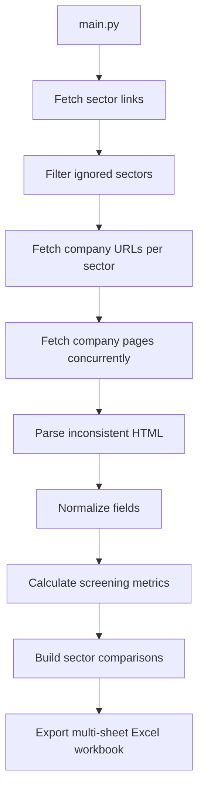

# DSE Company Data Scraper

> Production-minded async data pipeline for collecting, normalizing, and exporting Dhaka Stock Exchange company fundamentals from inconsistent public web pages.

[](https://www.python.org/)
[](https://docs.aiohttp.org/)
[](#excel-output)
[](#automation)
[](#license-and-usage)

## Why This Project Exists

The Dhaka Stock Exchange website exposes valuable company data, but the pages are not shaped like a clean API. Tables are nested, labels vary, values can move between sections, and missing fields are common. This project turns that messy public HTML into a structured Excel dataset that can be used for screening, research, and decision support.

This is not a toy scraper. It is built as a small data engineering system with async IO, adaptive throttling, retries, modular parsing, normalized financial fields, ordered exports, and scheduled GitHub Actions execution.


## Table Of Contents

- [Highlights](#highlights)
- [What It Collects](#what-it-collects)
- [Architecture](#architecture)
- [Data Quality Strategy](#data-quality-strategy)
- [Excel Output](#excel-output)
- [Automation](#automation)
- [Run Locally](#run-locally)
- [Security And IP Protection](#security-and-ip-protection)
- [Portfolio Value](#portfolio-value)
- [Project Structure](#project-structure)
- [Roadmap](#roadmap)
- [License And Usage](#license-and-usage)

## Highlights

| Area                  | Implementation                                                                              |
| --------------------- | ------------------------------------------------------------------------------------------- |
| Async pipeline        | `asyncio` orchestration with `aiohttp` network calls                                        |
| Adaptive throttling   | Dynamic request delay and concurrency reduction after failures                              |
| Retry strategy        | Request retries with jitter to reduce transient failures                                    |
| Sector discovery      | Automatically discovers tradable sector links from DSE                                      |
| Company discovery     | Collects company detail URLs per sector                                                     |
| Robust parsing        | Combines table extraction, DOM traversal, regex, and fallback logic                         |
| Normalization         | Converts raw strings into clean numeric and text fields                                     |
| Financial coverage    | Market data, capital structure, loans, EPS, P/E, audited metrics, dividends, ownership      |
| Analysis-ready export | Multi-sheet Excel workbook with raw data, processed analysis, sector summary, and watchlist |
| Workbook guide        | First worksheet explains workbook purpose, sheet usage, labels, and key metrics             |
| Primary screening     | Explainable valuation/watchlist labels with reasons and follow-up checks                    |
| Outlier handling      | Flags unusual or unreliable metrics before sector comparison                                |
| Automation            | Scheduled and manual GitHub Actions workflows                                               |

## What It Collects

The final workbook is designed around practical equity research workflows.

| Group                      | Example Fields                                                                                   |
| -------------------------- | ------------------------------------------------------------------------------------------------ |
| Identity                   | Company name, trading code, scrip code, sector, instrument type                                  |
| Listing metadata           | Listing year, market category, electronic share, debut trading date                              |
| Market price               | LTP, YCP, open, adjusted open, close, day range, 52-week range                                   |
| Movement                   | Change value and change percentage                                                               |
| Liquidity                  | Trade count, volume, traded value                                                                |
| Capital structure          | Market cap, free float cap, authorized capital, paid-up capital, securities, face value          |
| Debt and status            | Operational status, loan-status date, short-term loan, long-term loan, total loan                |
| EPS                        | Quarterly, half-yearly, nine-month, annual, continuing operations, diluted continuing operations |
| Annual audited performance | EPS, diluted EPS, NAVPS, operating cash flow, profit, total comprehensive income                 |
| Valuation                  | Basic EPS P/E, diluted EPS P/E, trailing P/E, audited basic EPS P/E                              |
| Corporate actions          | AGM, year ended, dividend year, dividend yield, cash dividend, bonus issue, right issue          |
| Ownership                  | Flattened shareholding percentage rows                                                           |

Noise fields such as graph labels are intentionally excluded from the export, while useful unmodeled DSE fields are still preserved at the end of the workbook.

The processed analysis layer is intended for primary screening only. It helps identify companies worth deeper research, but it is not an automatic buy/sell recommendation system.

## Architecture



The scraper keeps the pipeline split into small modules so each concern is easy to inspect, test, and extend.

```text
main.py
  -> pipelines/sectors.py
  -> pipelines/companies.py
  -> pipelines/company_info.py
  -> core/client.py
  -> core/parser.py
  -> export/excel.py
```

## Data Quality Strategy

DSE pages are inconsistent, so the parser does not rely on a single brittle selector. It uses layered extraction:

- Table scanning for structured key/value fields
- Targeted DOM traversal for nested sections
- Regex extraction for values embedded in page text
- Defensive null handling for missing or shifted fields
- Duplicate prevention when a field is already normalized under a clearer name
- Stable output ordering so every workbook is easy to compare over time
- Fully empty raw columns are removed from the raw-data worksheet and recorded in `Dropped_Empty_Columns`
- Sector comparisons use median and trimmed average alongside simple average to reduce outlier distortion
- Outlier flags separate unreliable metrics from usable valuation comparisons

## Excel Output

Generated files follow this pattern:

```bash
Export_Data/DSE_Data_{Market_Date}.xlsx
```

The workbook contains multiple worksheets:

| Worksheet               | Purpose                                                                 |
| ----------------------- | ----------------------------------------------------------------------- |
| `Workbook_Guide`        | Plain-language guide explaining sheets, labels, metrics, and usage      |
| `Raw_Scraped_Data`      | Cleaned raw scrape output with fully empty columns removed              |
| `Processed_Analysis`    | Derived ratios, sector comparisons, scores, valuation signal, and notes |
| `Sector_Summary`        | Sector-level averages, medians, trimmed averages, and decision counts   |
| `Watchlist`             | Focused list of companies that deserve follow-up review                 |
| `Data_Quality_Issues`   | Companies with weak reliability, missing fields, or outlier concerns    |
| `Dropped_Empty_Columns` | Audit list of raw columns removed because every company was blank       |

`Processed_Analysis` starts with `Company Name`, `Trading Code`, and `Sector` so the analysis can be reviewed without switching back to the raw sheet.

Long explanation fields are formatted for readability inside Excel. The workbook freezes useful panes, applies filters, styles header rows, wraps conclusion text, and keeps key identity columns visible while reviewing processed analysis.

Raw column groups are ordered for financial analysis:

1. Identity and listing metadata
2. Price and movement
3. Liquidity
4. Market value
5. Share capital
6. Debt and equity
7. EPS metrics
8. Audited annual financial performance
9. P/E ratios
10. Corporate actions
11. Shareholding
12. Remaining preserved scraped fields

### Processed Screening Metrics

The processed worksheet adds practical first-pass research fields, including:

| Category           | Example Columns                                                                 |
| ------------------ | ------------------------------------------------------------------------------- |
| Latest values      | Latest EPS used, latest NAVPS used, latest profit, latest operating cash flow   |
| Valuation ratios   | Latest P/E used, price to NAV, earnings yield, P/E vs sector median             |
| Sector comparison  | Sector average, median, and trimmed average for P/E, P/NAV, and dividend yield  |
| Balance-sheet risk | Debt to market cap, debt to profit, cash flow to profit                         |
| Price context      | Price position inside the 52-week range                                         |
| Ownership          | Sponsor/director, institute, foreign, and public holding percentages            |
| Ranking            | Sector market-cap rank and sector liquidity rank                                |
| Quality control    | Outlier flag, outlier reason, usable-for-sector-average flag, reliability score |
| Screening scores   | Value, quality, risk, liquidity, dividend, and final screening score            |
| Explanation        | Positive signals, negative signals, key risks, valuation reason, next checks    |

Final screening labels include:

- Potentially Undervalued
- Fairly Valued / Worth Watching
- Fairly Valued
- Potentially Overvalued
- Value Trap Risk
- Speculative / Risky
- Insufficient Data

The `What To Check Next` column suggests follow-up research, such as checking whether low P/E comes from recurring earnings or a one-time profit spike, whether dividend payout is sustainable, whether cash flow supports profit, whether loan maturity and finance cost are manageable, whether liquidity is enough for entry/exit, and whether sponsor, institutional, or foreign ownership trends need review.

## Automation

The GitHub Actions workflows support both scheduled and manual runs.

```yaml
cron: "20 14 * * 0-4"
```

This schedule runs Sunday through Thursday at 14:20 UTC, matching Bangladesh market days after the close. The current workflow uploads generated Excel files as GitHub Actions artifacts.

Important: for a public repository, workflow runs and retained artifacts may be visible to people with repository read access. If the generated Excel analysis should remain private, run the scheduled scraper in a private repository or upload the output to private storage instead of publishing artifacts from a public repo.

## Run Locally

```bash
git clone https://github.com/MustakAbsarKhan/DSE_COMPANY_SCRAPER_Python.git
cd DSE_COMPANY_SCRAPER_Python
python -m venv .venv
.venv\Scripts\activate
pip install -r requirements.txt
python main.py
```

On Linux or macOS, activate the environment with:

```bash
source .venv/bin/activate
```

## Configuration

`config.py` contains the main project configuration:

| Name              | Purpose                                        |
| ----------------- | ---------------------------------------------- |
| `DOMAIN`          | DSE base URL                                   |
| `MAIN_URL`        | DSE industry listing page                      |
| `IGNORED_SECTORS` | Non-equity-like sectors skipped by the scraper |

Current ignored sectors:

- Corporate Bond
- Debenture
- G-SEC (T.Bond)

## Security And IP Protection

This repository is designed to showcase engineering skill without exposing secrets or unnecessary runtime artifacts.

- No API keys, tokens, passwords, or private credentials are required.
- Runtime logs and generated Excel exports are ignored by Git.
- The local `Export_Data/` folder is ignored so newly generated workbooks are not accidentally added to source commits. This does not stop GitHub Actions from uploading `Export_Data/*.xlsx` as workflow artifacts.
- `.env` and virtual environment folders are ignored.
- Network access is limited to public DSE pages.
- Generated artifacts should be shared intentionally through GitHub Actions, not committed as source.
- See [SECURITY.md](SECURITY.md) for reporting guidance.

Important: public repositories can always be viewed and copied technically. Protection comes from license terms, attribution, commit history, public proof of authorship, and limiting what sensitive or proprietary material is published.

## Portfolio Value

This project demonstrates practical skills that matter in freelance and professional data roles:

- Async Python system design
- Resilient scraping under unstable HTML structures
- Financial data normalization
- Defensive parsing and graceful degradation
- Explainable Excel reporting for business users
- Sector-relative equity screening
- Outlier-aware data quality handling
- GitHub Actions automation
- Modular code organization
- Clear documentation for maintainability

## Project Structure

```text
DSE_COMPANY_SCRAPER_Python/
|
├── .github/workflows/
│   ├── dse_scraper.yml      # Scheduled/manual production-style run
│   └── manual.yml           # Manual execution workflow
|
├── core/
│   ├── client.py            # Async HTTP client with adaptive throttle
│   ├── holidays.py          # DSE holiday/weekend checker
│   ├── logger.py            # Shared logger setup
│   └── parser.py            # HTML parsing and normalization
|
├── export/
│   └── excel.py             # Multi-sheet raw and processed Excel export
|
├── pipelines/
│   ├── sectors.py           # Sector discovery
│   ├── companies.py         # Company URL discovery
│   └── company_info.py      # Company profile scraping
|
├── config.py
├── main.py
├── requirements.txt
├── SECURITY.md
└── README.MD
```

## Roadmap

- Add unit tests for parser helpers and Excel column ordering
- Add unit tests for processed screening metrics and classification rules
- Add optional CSV and Parquet exports
- Add historical snapshot storage
- Add schema validation for exported rows
- Add a dashboard layer for screening and comparisons
- Add configurable scoring weights and sector-specific rule overrides
- Add CI checks for formatting and tests

## Author

**Mohammad Mustak Absar Khan**

Original creator and maintainer.

- GitHub: [MustakAbsarKhan](https://github.com/MustakAbsarKhan)
- Email: [mustak.absar.khan@gmail.com](mailto:mustak.absar.khan@gmail.com)

## License And Usage

Copyright (c) Mohammad Mustak Absar Khan.

This project is published for portfolio review, educational inspection, and hiring evaluation. Commercial use, resale, redistribution, or claiming this work as your own is not permitted without written permission from the author.

See [LICENSE.md](LICENSE.md) for the full terms.
