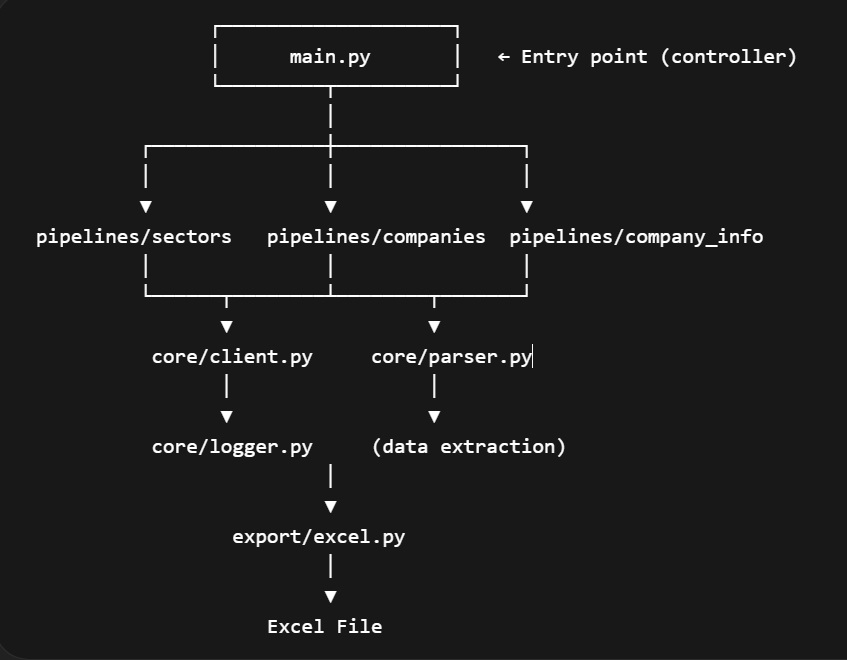

# 📊 DSE Company Data Scraper


---

## 🚀 Overview

A **production-ready, asynchronous pipeline-based web scraper** designed to extract comprehensive company data from the Dhaka Stock Exchange (DSE) with high performance and reliability.

This project demonstrates **advanced Python engineering practices**, including **async programming, modular architecture, and real-world scraping techniques**, making it suitable for both **portfolio showcasing and production deployments**.

---

## 🧠 Key Highlights

* 🔄 **Asynchronous Pipeline-Based Architecture** (concurrent data flow)
* 🧩 **Modular Design** (clean separation of concerns)
* 🔁 **Adaptive Rate Limiting & Retry Mechanism** for resilient scraping
* ⚡ **High-Performance Async Scraping** using aiohttp
* 📦 **Comprehensive Data Extraction** (40+ financial metrics)
* 📊 **Structured Data Output** (Excel via Pandas)
* 🛠️ **Production-Ready Logging System**
* 🚀 **Concurrency Control** for optimal performance

---

## 🏗️ Architecture

```bash
main.py (Async Orchestrator)
   ↓
Concurrent Sector Processing (Semaphore-controlled)
   ↓
sectors pipeline → companies pipeline → company info pipeline
   ↓
export module (Excel Output)
```

### Execution Flow


---

## 📁 Project Structure

```bash
dse_scraper/
│
├── core/
│   ├── client.py        # Async HTTP client with rate limiting
│   ├── parser.py        # HTML parsing & data extraction
│   ├── logger.py        # Logging configuration
│
├── pipelines/
│   ├── sectors.py       # Fetch sectors
│   ├── companies.py     # Fetch companies per sector
│   ├── company_info.py  # Extract detailed company data
│
├── export/
│   ├── excel.py         # Export data to Excel
│
├── config.py            # Configuration settings
├── main.py              # Async entry point
├── requirements.txt     # Python dependencies
├── .gitignore           # Git ignore rules
├── Execution Flow.jpg   # Architecture diagram
└── README.md
```

---

## 📊 Data Extracted

The scraper collects comprehensive company data including:

### Basic Information
* Company Name
* Trading Code
* Scrip Code
* Sector
* Instrument Type

### Pricing & Trading
* Last Trading Price (LTP)
* Opening Price
* Closing Price
* Yesterday's Closing Price (YCP)
* Adjusted Opening Price
* Day's Range (Low/High)
* 52 Weeks' Moving Range (Low/High)
* Change Value & Percentage

### Liquidity & Volume
* Day's Trade (Number)
* Day's Volume
* Day's Value (mn)

### Market Metrics
* Market Capitalization (mn)
* Free Float Market Cap (mn)
* Authorized Capital (mn)
* Paid-up Capital (mn)
* Face/Par Value
* Market Lot
* Total Outstanding Securities

### Corporate Information
* Debut Trading Date
* Last AGM Date
* Dividend Information (Year, Yield %, Cash, Bonus, Right Issue)
* Year End

### Shareholding Data
* Share Holding Percentages (as on specific dates)

---

## ⚙️ Tech Stack

* **Python** (asyncio for asynchronous operations)
* **aiohttp** (asynchronous HTTP handling)
* **BeautifulSoup (bs4)** (HTML parsing)
* **Pandas** (data processing & export)
* **openpyxl** (Excel engine)
* **lxml** (XML/HTML parser)

---

## 🧪 How to Run

### 1. Clone the repository

```bash
git clone https://github.com/yourusername/dse-scraper.git
cd dse-scraper
```

### 2. Install dependencies

```bash
pip install -r requirements.txt
```

### 3. Run the scraper

```bash
python main.py
```

---

## 📦 Output

* Generates: `Export_Data/DSE_Data_{Market_Date}.xlsx` (structured Excel dataset with date-based filename)
* Generates: `DSECompanyScraper.log` (detailed execution logs)
* Ready for financial analysis and data processing

---

## 🔄 Version History

### 🔹 v2.0 (Current)

* **Asynchronous Architecture**: Implemented async scraping with aiohttp for high performance
* **Advanced Rate Limiting**: Adaptive rate limiter with jitter and concurrency control
* **Comprehensive Logging**: Production-ready logging system with file and console output
* **Extended Data Fields**: Expanded to 40+ financial and corporate metrics
* **Refactored into pipeline-based modular architecture**
* **Improved maintainability and scalability**
* **Separated parsing, networking, and processing logic**

---

## 🎯 Use Cases

* 📈 Stock market data collection
* 📊 Financial analysis datasets
* 🤖 Automation & scraping projects
* 💼 Freelancing portfolio showcase

---

## 🚧 Future Improvements

* Proxy rotation support for enhanced anonymity
* CLI arguments for customization
* API-based data serving
* Database integration for data persistence
* Web dashboard for monitoring

---

## 👨‍💻 Author

**Mohammad Mustak Absar Khan**
📧 [mustak.absar.khan@gmail.com](mailto:mustak.absar.khan@gmail.com)

---

## ⭐ Why This Project Matters

This project demonstrates the transition from:

> ❌ Basic scripting → ✅ Scalable software design

It reflects **real-world engineering practices**, including:

* Refactoring
* Modular architecture
* Pipeline design

---

## 📜 License

This project is licensed under the MIT License.

---

## 🌟 Support

If you found this useful:

* ⭐ Star the repository
* 🍴 Fork it
* 🛠️ Contribute

---
